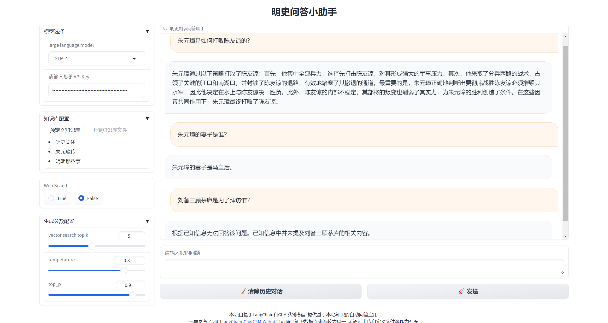

# Ming-Dynasty-ChatBot

# 介绍

本项目是基于LangChain和GLM-4模型构造的一个简单的明史知识问答机器人，目前的知识库来源于：

- 明史简述
- 朱元璋传
- 明朝那些事儿

对上述文件进行简单清洗和整理后基于Chroma构建向量数据库，目前知识库数量较少，后续将搜集更多相关历史文献用于增强知识问答能力。

# 效果展示

目前该项目可在ModelScope魔搭社区进行[在线体验](https://modelscope.cn/studios/sleep10h1d/History-Chat-Bot)，以下是一个简单的展示示例。

# 其他说明

本项目主要参考了项目[LangChain-ChatGLM-Webui](https://github.com/thomas-yanxin/LangChain-ChatGLM-Webui)，目前本项目开发时间较短，内容十分简陋，欢迎持续关注。